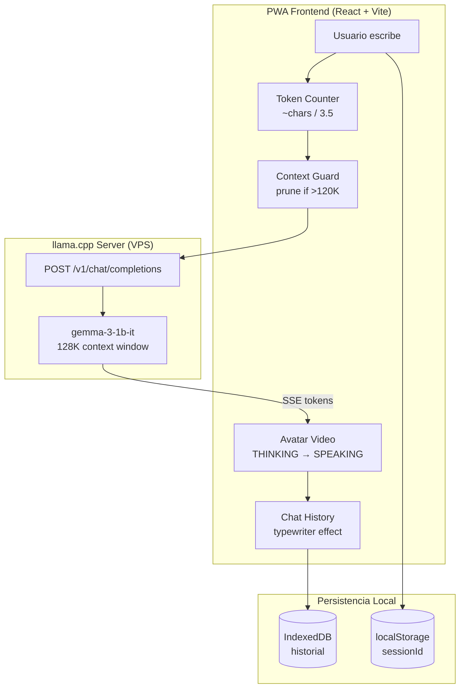

# MarIA — Asistente Académico Virtual (PWA)

<div align="center" style="margin-bottom: 32px;">
  
</div>

Progressive Web App del Asistente Virtual Académico **MarIA**, dirigido a la comunidad universitaria de la **UNEFA Núcleo Apure** (estudiantes, docentes y personal administrativo).

El backend corre un servidor [llama.cpp](https://github.com/ggerganov/llama.cpp) con el modelo `gemma-3-1b-it-Q4_K_M.gguf`, expuesto mediante una API compatible con OpenAI en `https://unefa-asistente.duckdns.org/v1/chat/completions`.

---

## Arquitectura del Sistema



**Protocolo:** SSE streaming via `fetch` + `ReadableStream`. Cada token generado por el modelo se transmite al frontend en tiempo real y se renderiza progresivamente con efecto de escritura. El prompt se guarda automaticamente si excede el limite de contexto (120K tokens).

---

## Stack Tecnológico

| Capa | Tecnología | Versión |
|------|------------|---------|
| Bundler | [Vite](https://vitejs.dev/) | ^5.2 |
| UI | [React](https://react.dev/) | ^18.2 |
| Estilos | [Tailwind CSS](https://tailwindcss.com/) | ^3.4 |
| 3D | [Three.js](https://threejs.org/) + [@react-three/fiber](https://github.com/pmndrs/react-three-fiber) + [@react-three/drei](https://github.com/pmndrs/drei) | ^0.164 / ^8.16 |
| Video | HTML5 `<video>` nativo (sin librería externa) | — |
| PWA | [vite-plugin-pwa](https://vite-pwa-org.netlify.app/) | ^0.20 |
| PostCSS | autoprefixer + postcss | ^10.4 / ^8.4 |

---

## Estructura de Archivos

```
PWA-Virtual-Assistant/
├── index.html                  # Entry point HTML (PWA metas, iOS safe-area, fuentes)
├── package.json                # Dependencias y scripts
├── tailwind.config.js          # Paleta custom, fuentes, animaciones
├── postcss.config.js           # Pipeline de PostCSS
├── .gitignore
├── bun.lock                     # Lockfile de Bun
│
├── src/
│   ├── main.jsx                # Punto de entrada de React + SW registration
│   ├── App.jsx                 # Layout principal, state machine, SSE integration
│   ├── index.css               # Directivas Tailwind + resets + scrollbar custom + noise overlay
│   │
│   ├── assets/
│   │   └── unefa_logo.png      # Logo institucional de la UNEFA
│   │
│   ├── components/
│   │   ├── Header.jsx          # Branding + selector de rol (E / O) + indicador de conexion
│   │   ├── VideoAvatar.jsx     # Avatar con video loop (reemplaza AvatarCanvas en uso)
│   │   ├── AvatarCanvas.jsx    # Canvas de React Three Fiber (preservado, no en uso)
│   │   ├── AvatarScene.jsx     # Avatar 3D procedural (preservado, no en uso)
│   │   ├── ChatHistory.jsx     # Historial con scroll, efecto de escritura, bold markdown, retry inline
│   │   ├── ChatInput.jsx       # Input de texto + boton enviar / detener + token counter
│   │   └── InstallBanner.jsx   # Banner de instalacion PWA (Android + iOS)
│   │
│   └── lib/
│       ├── api.js              # Cliente SSE + estimador de tokens + context guard
│       └── db.js               # IndexedDB: getSessionId, loadMessages, saveMessages, clearSession
│
└── public/
│   ├── MarIA.mp4               # Video del avatar (loop sin fisuras)
│   ├── MarIA-poster.jpg        # Poster frame para estado IDLE
│   ├── manifest.webmanifest    # PWA manifest
│   ├── offline.html            # Fallback offline
│   ├── robots.txt              # Reglas de crawling
│   ├── release-info.json       # Info de version
│   └── icons/                  # Iconos PWA (192, 512, maskable)
```

---

## Componentes Principales

### `Header.jsx`
- Logo de la UNEFA + nombre de la app
- **Selector de rol:** `E` (Estudiante) / `O` (Otro Personal)
- **Indicador de conexion:** punto verde (online) / rojo (offline)
- ID de sesion visible

### `AvatarCanvas.jsx`
- Renderiza el avatar 3D con React Three Fiber
- **Deteccion de WebGL:** si no disponible, muestra fallback CSS con anillos animados
- `<Suspense>` con `LoadingAvatar` mientras carga

### `AvatarScene.jsx`
- **Avatar procedural:** esfera teal emisiva con:
  - 3 anillos orbitales a distintos angulos (rotan a velocidad variable segun estado)
  - Brillo ambiental (glow shell)
  - Reflejo en suelo (disc)
  - Highlight superficial para dimension
- **Maquina de estados animada:** `IDLE` (respiracion lenta) → `THINKING` (pulso rapido + anillos veloces) → `SPEAKING` (pulso medio) → `ERROR` (tenue, color apagado)
- Transiciones suaves via `lerp` en cada frame

### `ChatHistory.jsx`
- Scroll automatico sincrono (`requestAnimationFrame` + `scrollTop`)
- **Efecto de escritura:** ultimo mensaje del asistente se revela progresivamente (~330 chars/sec) mientras streaming esta activo
- **Markdown bold:** `**texto**` se renderiza como `<strong>`
- **Mensajes de error:** con boton `Reintentar` inline
- **Indicador de pensando:** 3 dots animados (`animate-bounce`)

### `ChatInput.jsx`
- Input con placeholder dinamico (online/offline)
- Boton **enviar** (teal) cuando ocioso, boton **detener** (rojo) durante streaming
- Badge "Sin conexion" cuando offline
- **Token Counter en tiempo real:** `~X tokens · Y% used` bajo el input
  - Verde (<20%), amarillo (20–60%), rojo (>60%)
  - Calcula: system prompt (~80) + historial + mensaje nuevo + max_output (2048)
  - Deshabilita envio si excede 120K tokens

### `VideoAvatar.jsx` (nuevo)
- Avatar basado en video `<video>` en lugar de WebGL
- Loop perfecto: reproduce mientras `avatarState === 'SPEAKING'`, pausa en `IDLE`
- Estados visuales via CSS: `opacity`, `blur`, `grayscale`, `scale`
- Poster frame para estado IDLE (extraido del primer frame del video)
- Fallback: si el video falla, muestra el frame del poster

### `InstallBanner.jsx` (nuevo)
- Detecta evento `beforeinstallprompt` (Android/Chrome)
- Modal de instrucciones para iOS Safari ("Compartir → Agregar a pantalla de inicio")
- Politica de descartes: snooze 7 dias o "nunca mas"
- Solo visible en navegador (no en modo standalone PWA)
- Espaciador reserva espacio en layout para no tapar el input

### Token Counter & Context Guard (en `api.js`)
- **Estimador client-side:** `text.length / 3.5` chars por token (~±10% precision para español)
- **Context Guard:** antes de cada request, si el prompt estimado excede 120K, elimina los pares user+assistant mas antiguos iterativamente
- Nunca elimina el mensaje actual del usuario
- Log en consola: `Pruned N pairs. Prompt: ~X tokens.`

---

## Flujo de Datos

```
Usuario escribe → Token Counter estima tokens en tiempo real
  ↓
handleSendMessage (App.jsx) → Context Guard: prune oldest pairs si >120K
  ↓
Guarda mensaje user en estado + IndexedDB
  ↓
Construye payload [system, historial-pruned, user] → streamChat (api.js)
  ↓
POST SSE a llama.cpp (max_tokens: 2048) → recibe tokens via ReadableStream
  ↓
onFirstToken: crea mensaje assistant vacio + avatarState = SPEAKING
  ↓
onToken: concatena token al mensaje assistant (efecto escritura activo)
  ↓
onDone: avatarState = IDLE tras finalizar typewriter + verifica mensaje vacio
  ↓
onError: avatarState = ERROR + mensaje de error con [Reintentar]
```

---

## Persistencia

- **Session ID:** UUID generado via `crypto.randomUUID()`, almacenado en `localStorage`
- **Mensajes:** Array completo de conversaciones guardado en IndexedDB (`LumiDB` → `conversations`) bajo la clave `sessionId`
- **Restauracion:** al montar la app, carga mensajes previos automaticamente
- **Limpieza:** funcion `clearSession(sessionId)` disponible en `db.js`

---

## Instalación y Desarrollo

### Requisitos previos
- [Bun](https://bun.sh/) >= 1.0 (recomendado) o Node.js >= 18.x

### Pasos

```bash
# 1. Clonar el repositorio
git clone https://github.com/<tu-usuario>/PWA-Virtual-Assistant.git
cd PWA-Virtual-Assistant

# 2. Instalar dependencias
bun install

# 3. Iniciar servidor de desarrollo
bun run dev
```

La app estará disponible en `http://localhost:5173`.

### Build de producción

```bash
bun run build
bun run preview   # Previsualizar el build localmente
```

Los archivos generados se encuentran en la carpeta `dist/`.

---

## Diseño y Estética

La interfaz sigue una dirección de diseño **dark cinematic / command-center**:

- **Paleta:** Fondos de obsidiana profundo (`#0a0e1a` → `#1e253c`) con acento eléctrico teal (`#00e5c8`).
- **Tipografía:** [Syne](https://fonts.google.com/specimen/Syne) (display) + [Outfit](https://fonts.google.com/specimen/Outfit) (body).
- **Efectos:** Glassmorphism con `backdrop-blur`, textura de ruido sutil (`noise-overlay`), anillos orbitales pulsantes en el avatar, micro-animaciones de entrada.
- **Layout:** Mobile-first, `h-dvh` sin scroll de pagina, compatible con iOS safe-area (`viewport-fit=cover`).

---

## Roadmap

- [x] Scaffolding del proyecto (Vite + React + Tailwind)
- [x] Layout principal mobile-first sin scroll
- [x] Selector de rol (Estudiante / Otro Personal)
- [x] Chat con historial, input y scroll interno
- [x] Avatar 3D procedural con Three.js (esfera + anillos + animaciones)
- [x] Integracion con backend via SSE streaming
- [x] Efecto de escritura progresiva
- [x] Markdown bold en respuestas
- [x] Persistencia de sesion con IndexedDB
- [x] Deteccion online/offline + estados de error + retry
- [x] AbortController para detener streaming
- [x] Service Worker y cache offline (PWA completa)
- [x] Install banner (Android + iOS)
- [x] Update banner para nuevas versiones
- [x] Video avatar con estados sincronizados al streaming
- [x] Token counter en tiempo real + context guard
- [ ] Síntesis de voz (TTS) para respuestas
- [ ] Deploy de la PWA

---

## Equipo

Desarrollado como proyecto académico para la materia de **Lenguaje de Programación III** — UNEFA Núcleo Apure.
